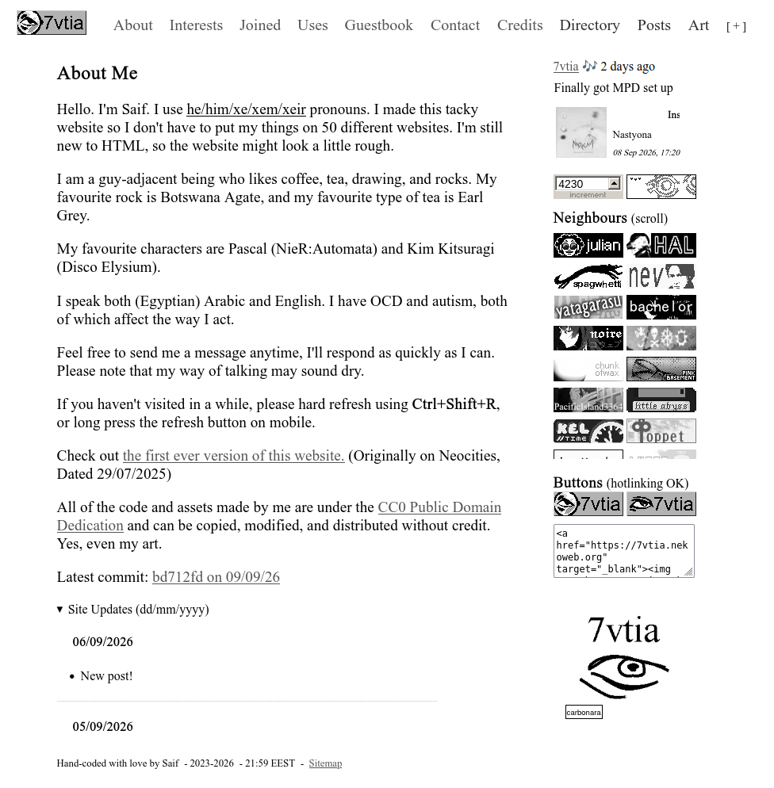

## Colour Palettes

If you look at my website, you'll see that most of it is just black text on a white background, with some grey links. It's nice, but in my opinion it's not what makes the site _great_.

What makes it great is the pops of colour. I have a greyscale class in my CSS that adds a greyscale filter to the element as you might've guessed.

But, I don't put that on my entire website. Why? You can see for yourself.

Looks depressing, right? Hell, I might get so depressed from looking at this that I lose the will to finish writing this post.

First of all, I have a rule for my website that if I add someone else's button, I'm not going to slap some filter on that sucks all the colour out. I want the original colours that the creator chose for their button.

Sure, the filter disappears on hover, but why? My life isn't in greyscale. I like when the sea of black and white is broken by some vibrant colours. I'm not looking to make my website look like a doctor's office.

The bigger issue to me is that I simply don't enjoy it that much when everything is limited to a specific colour palette. Before you say "But Saif, you exclusively draw in blue..." That's because I'm too lazy to pick out a different colour, okay?

Don't get me wrong, some people execute the whole limited colour palette thing extremely well. Other times, I'm begging to see something other than pink, or green, or whatever filter is on.

At the end of the day, you can choose whatever colour palette you want. Yellow text on a purple background, a website entirely made of rainbow gradients, who the hell cares? It's your website. In my case, I find pops of colour much more enjoyable than your average fully-monochrome palette.
